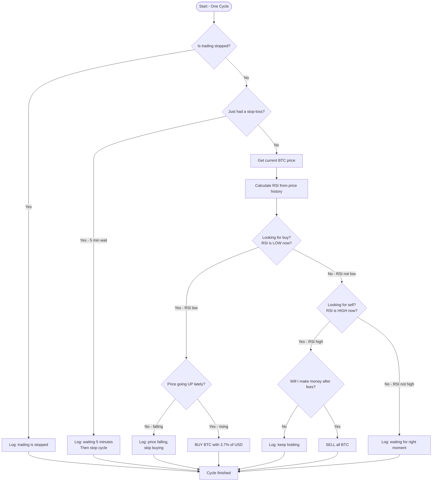
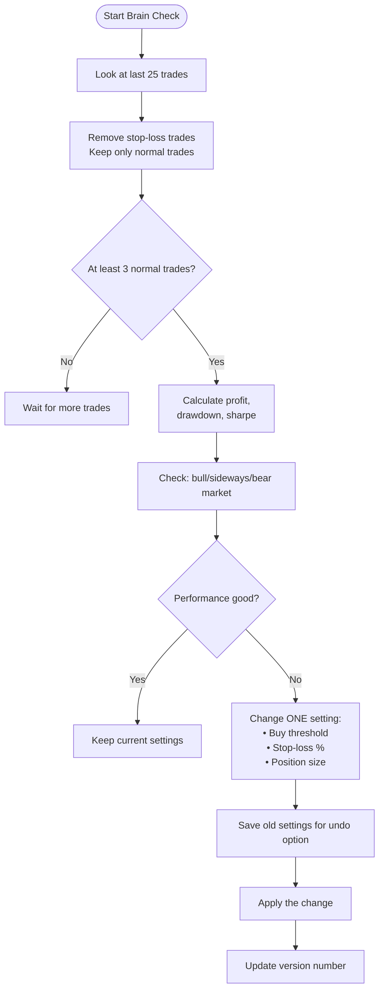

# How the Trading Bot Works (Simple Flow)

This flowchart shows what happens every minute when the bot runs.

## Main Trading Loop (Every Minute)



## What Does "RSI" Mean?

- **RSI = Relative Strength Index** (0 to 100)
- **LOW RSI (< 66)** means price is "oversold" → **BUY signal**
- **HIGH RSI (> 76)** means price is "overbought" → **SELL signal**

The bot uses a **dynamic sell threshold** that changes based on:
- What RSI was when you bought
- The fees you will pay

## Self-Improvement Brain (After Every 3 Successful Trades)

When you complete 3 winning or losing trades, the bot asks itself:



## Key Rules

| Rule | What It Does |
|------|--------------|
| **Stop-loss** | If price drops 1.6% below buy price → sell immediately to limit loss |
| **5-minute cooldown** | After stop-loss, wait before buying again |
| **Trend filter** | Don't buy if price has been falling for 20 minutes |
| **24-hour warning** | Alert if holding a position for more than 1 day |
| **Fee protection** | Don't sell if you'd lose money to trading fees |

## Config Settings (in config.json)

```json
{
  "indicator_threshold": 66.15,   // RSI level to buy at
  "stop_loss_pct": 0.016,         // 1.6% stop-loss
  "position_size_pct": 0.037,     // 3.7% of balance per trade
  "reflection_cadence": 3,        // Think after every 3 trades
  "target_asset": "BTC/USDT"      // Trading pair
}
```